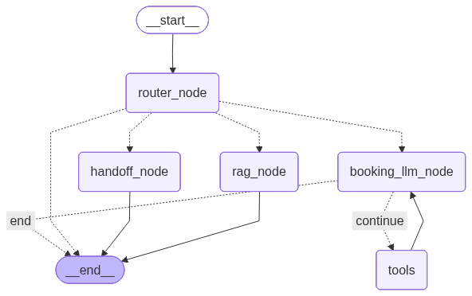

# COB Demo Agent (FastAPI + LangGraph + Streamlit)

A production-style demo chatbot built with **FastAPI** (backend), **LangGraph** (agent orchestration), and **Streamlit** (chat UI).

It supports **routing** between:

* **General chat** (direct answer)
* **Knowledge Base (RAG)** (retrieval + grounded answer)
* **Booking flow** (tool-using agent backed by SQLite)
* **Handoff** (flags when a human should take over)

---

## What you get

### ✅ Key features

* **LangGraph multi-node agent** with clear, debuggable execution flow.
* **RAG (Chroma + Gemini Embeddings)** for answering from a JSON knowledge base.
* **Booking tools (SQLite)** for listing/checking/booking appointments.
* **Handoff safety**: when `handoff_required=true`, the UI locks and shows a red flag.
* **Strong logging (SRE-ready)**: node-level trace logs + errors in `logs/app.log`.
* **FastAPI + Pydantic** request/response validation.
* **Streamlit UI**: wide, dark, ChatGPT-like chat interface.

---

## Architecture (high level)

**User → Streamlit → FastAPI → LangGraph**

LangGraph routes a message to one of these flows:

1. **router_node** → chooses route: `general | kb | booking | handoff`
2. **rag_node** → retrieve KB chunks → generate grounded answer
3. **booking_llm_node** ↔ **tools** loop (bounded) → confirm booking
4. **handoff_node** → returns decision + message; UI locks if required

### Suggested diagram (add an image here)



---

## Requirements

* Python **3.10+**
* A **Gemini / Google GenAI API key**

---

## Setup & Run (using `uv`)

> These steps are intentionally explicit so anyone can run the project quickly.

### 1) Clone / open the project folder

```bash
cd AI_Chatbot_Agent
```

### 2) Create and activate the environment (uv)

```bash
uv venv
```

Activate:

* **Windows (PowerShell):**

```powershell
.\.venv\Scripts\Activate.ps1
```

* **Windows (cmd):**

```bat
.\.venv\Scripts\activate.bat
```

* **macOS/Linux:**

```bash
source .venv/bin/activate
```

### 3) Install dependencies

```bash
uv sync
```

### 4) Create `.env`

Create a file named `.env` in the project root (same folder as `main_api.py`).

Add your API key:

```env
GOOGLE_API_KEY=YOUR_KEY_HERE
ROUTER_API_KEY=your_router_model_key_here
RAG_API_KEY=your_rag_model_key_here
BOOKING_API_KEY=your_booking_model_key_here
HANDOFF_API_KEY=your_handoff_model_key_here
```

Optional (paths & safety):

```env
COB_LOGS_DIR=./logs
COB_DATA_DIR=./data
COB_DB_PATH=./data/appointments.db
COB_KB_JSON_PATH=./data/cob_kb.json
COB_PERSIST_DIR=./data/chroma_langchain_db

COB_MAX_RETRIES=1
COB_MAX_TOOL_STEPS=4
```

> **Security note:** never commit your `.env` file.

### 5) Prepare data (KB + DB)

#### A) Knowledge Base (RAG)

Place your KB JSON at:

```
./data/cob_kb.json
```

Expected format (example):

```json
[
  {
    "id": "chunk_001",
    "title": "Pricing",
    "category": "FAQ",
    "source_file": "faq.md",
    "paragraph_index": 1,
    "lang": "en",
    "text": "Your KB chunk text here..."
  }
]
```

#### B) Booking DB (SQLite)

Place your SQLite DB at:

```
./data/appointments.db
```

The tools expect a table named `appointments` with columns similar to:

* `service` (TEXT)
* `date` (TEXT, YYYY-MM-DD)
* `time` (TEXT, HH:MM)
* `status` (TEXT: free|booked)
* `customer_name` (TEXT)
* `phone` (TEXT)
* `created_at` (TEXT)

> If you don’t have a DB yet, create one using a small seed script (recommended future improvement).

---

## Run the backend (FastAPI)

From the project root:

```bash
uvicorn main_api:app --reload
```

Check:

* Health: `GET http://127.0.0.1:8000/health`
* Chat: `POST http://127.0.0.1:8000/api/chat`

### Example request

```bash
curl -X POST http://127.0.0.1:8000/api/chat \
  -H "Content-Type: application/json" \
  -d '{"message":"I want to book a haircut on 2025-12-30 at 10:00","thread_id":"123456"}'
```

---

## Run the frontend (Streamlit)

In a new terminal (same venv):

```bash
streamlit run streamlit_chat.py
```

The UI will:

* Generate a **random 6-digit `thread_id`** once per session
* Send `thread_id + user message` to the backend
* Show only `reply`
* If `handoff_required=true`, it will show a **red flag** and lock the chat

### Optional: change backend URL

```bash
export COB_BACKEND_CHAT_URL=http://127.0.0.1:8000/api/chat
```

On Windows (PowerShell):

```powershell
$env:COB_BACKEND_CHAT_URL = "http://127.0.0.1:8000/api/chat"
```

---

## Logging & Debugging

Logs are written to:

```
./logs/app.log
```

What you’ll see:

* `[node_enter]` / `[node_exit]` for each node
* tool calls loop steps (bounded)
* classified upstream errors (quota/rate limits, timeouts, etc.)

### Common issues

**1) Missing API key**

* Ensure `.env` is in the project root
* Ensure the variable name is exactly: `GOOGLE_API_KEY`

**2) Empty KB / no RAG results**

* Confirm `COB_KB_JSON_PATH` points to a real file

**3) Booking tools can’t find DB/table**

* Confirm `COB_DB_PATH` points to an existing SQLite DB
* Confirm the `appointments` table exists

---

## Roadmap (future work)

### Near-term improvements

* **Seed scripts**

  * `scripts/seed_db.py` to create appointments DB
  * `scripts/seed_kb.py` to validate KB JSON structure
* **Observability upgrades**

  * Add request IDs and correlate them through logs
  * Prometheus metrics for latency, error rate, tool loop count
* **Persistence**

  * Replace `InMemorySaver` with a durable checkpointer (Redis/Postgres)
* **Auth & rate limiting**

  * API key auth for the backend endpoints
  * rate limiting for public deployments

### Product upgrades

* Add an **admin dashboard** to review handoff tickets
* Add **multi-service booking policies** (duration, buffers, blackout dates)
* Add **RAG citations** (return chunk titles/ids to UI)

---

## Screenshots (recommended)

Create a folder:

```
docs/images/
```

Add these images:

* `docs/images/architecture.png` → architecture diagram
* `docs/images/streamlit_ui.png` → Streamlit chat screenshot
* `docs/images/logs_sample.png` → sample `logs/app.log` snippet

Then include them here:


---

## License

Internal / demo use. Add a license if you plan to distribute.
